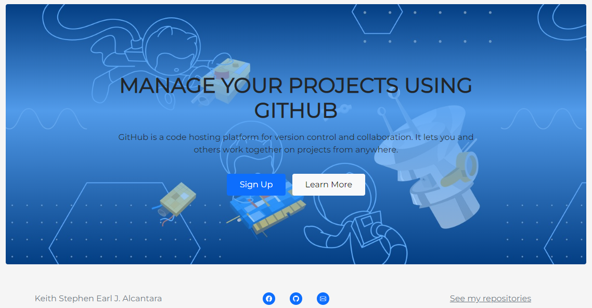
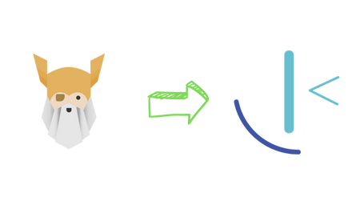
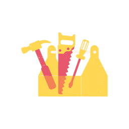
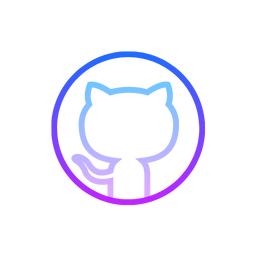

<!-- HEADER -->

  

  
   
   <h1>Start your Frontend Journey today!</h1>
   
Create wonderful websites from zero to hero with these guides.  
   Explore the possibilities of web designing and get to publish your very own project for the world to see

   
    
   
   <a href="https://stephenalcantara.github.io/learn-frontend/">
    View deployment page
   </a>

   
     

<!-- TABLE OF CONTENTS -->

# Table Of Contents

   
Table of Contents

      <ol>
        <li>
          <a href="#about-the-project">About Learn Frontend</a>
          <ul>
            <li>
              <a href="#built-with">Built with</a>
            </li>
          </ul>
        </li>
        <li>
          <a href="#where-to-start">Where to start learning</a>
        </li>
        <li>
          <a href="#frameworks">Using frameworks</a>
        </li>
        <li>
          <a href="#github">Create your own Github repo</a>
        </li>
      </ol>

  

<!-- ABOUT LEARN FRONTEND -->

# About The Project

 
  
  
  <h2 id="about">What is <code>Learn Frontend</code>?</h2>
  
Originally created as a sample design website,  
  it aims for the audience who are presumptively coding beginners,  
  a roadmap to get them started in their web designing path.

   
  
The Frontend developer career path may seem intimidating at first  
  but don't worry, with these simplified steps,  
  you'll surely get to love coding and designing alike!

  
   
(<a href="#table-of-contents">Back to top</a>)

  
    

<!-- BUILT WITH -->

# Built With

 
  <h3>
    <kbd>Built with</kbd>
  </h3>
  
  [![Sass][Sass]][Sass-url]
  [![Bootstrap][Bootstrap.com]][Bootstrap-url]
  [![Fullpage][Fullpage]][Fullpage-url]
  
   
(<a href="#table-of-contents">Back to top</a>)

  
    

<!-- WHERE TO START LEARNING -->

# Where To Start

 
  
  

  <h2>Where to start learning</h2>
    
Learn the fundamentals of the web, frontend and Github here at: 
      <a href="https://www.theodinproject.com/">Odin Project</a>
    

     
    
Start practicing your web designing skills here at: 
     <a href="https://www.frontendmentor.io/">Frontend Mentor</a>
   

   
    
(<a href="#table-of-contents">Back to top</a>)

   
     

<!-- USING FRAMEWORKS -->

# Frameworks

  
  

  <h2>What are Frameworks</h2>
  
They are templates and packages having pre-written,  
  standardized code in folders and files.   
  They offer you a base to develop on while still  
  enabling flexibility with the concluding design.

  
    
  
  <h3>Some example of frameworks are:</h3>
  
  [![Next][Next.js]][Next-url]
  [![React][React.js]][React-url]
  [![Vue][Vue.js]][Vue-url]
  [![Angular][Angular.io]][Angular-url] 
   
  [![Svelte][Svelte.dev]][Svelte-url]
  [![Laravel][Laravel.com]][Laravel-url]
  [![Bootstrap][Bootstrap.com]][Bootstrap-url]
  [![JQuery][JQuery.com]][JQuery-url]
  
   
(<a href="#table-of-contents">Back to top</a>)

  
    

<!-- GITHUB -->

# Github

 
  
  

  <h2>What is Github</h2>

  
GitHub is a code hosting platform for version control and collaboration.  
  It lets you and others work together on projects from anywhere.

  
   
  
  
A code repository is an archive of the code that is being worked on.  
  Beyond the code itself, you can keep things such as documentation,  
  notes, web pages, and other items in your repository.    
  A code repository is required for any successful software development project

  
   
(<a href="#table-of-contents">Back to top</a>)

<!-- MARKDOWN LINKS & IMAGES -->

[Sass]: https://img.shields.io/badge/Sass-FF69B4?style=for-the-badge&logo=sass&logoColor=white
[Sass-url]: https://sass-lang.com/

[Bootstrap.com]: https://img.shields.io/badge/Bootstrap-563D7C?style=for-the-badge&logo=bootstrap&logoColor=white
[Bootstrap-url]: https://getbootstrap.com

[Fullpage]: https://img.shields.io/badge/Fullpage.js-ffff00?style=for-the-badge&logo=javascript&logoColor=white
[Fullpage-url]: https://alvarotrigo.com/fullPage/

[Next.js]: https://img.shields.io/badge/next.js-000000?style=for-the-badge&logo=nextdotjs&logoColor=white
[Next-url]: https://nextjs.org/

[React.js]: https://img.shields.io/badge/React-20232A?style=for-the-badge&logo=react&logoColor=61DAFB
[React-url]: https://reactjs.org/

[Vue.js]: https://img.shields.io/badge/Vue.js-35495E?style=for-the-badge&logo=vuedotjs&logoColor=4FC08D
[Vue-url]: https://vuejs.org/

[Angular.io]: https://img.shields.io/badge/Angular-DD0031?style=for-the-badge&logo=angular&logoColor=white
[Angular-url]: https://angular.io/

[Svelte.dev]: https://img.shields.io/badge/Svelte-4A4A55?style=for-the-badge&logo=svelte&logoColor=FF3E00
[Svelte-url]: https://svelte.dev/

[Laravel.com]: https://img.shields.io/badge/Laravel-FF2D20?style=for-the-badge&logo=laravel&logoColor=white
[Laravel-url]: https://laravel.com

[JQuery.com]: https://img.shields.io/badge/jQuery-0769AD?style=for-the-badge&logo=jquery&logoColor=white
[JQuery-url]: https://jquery.com
